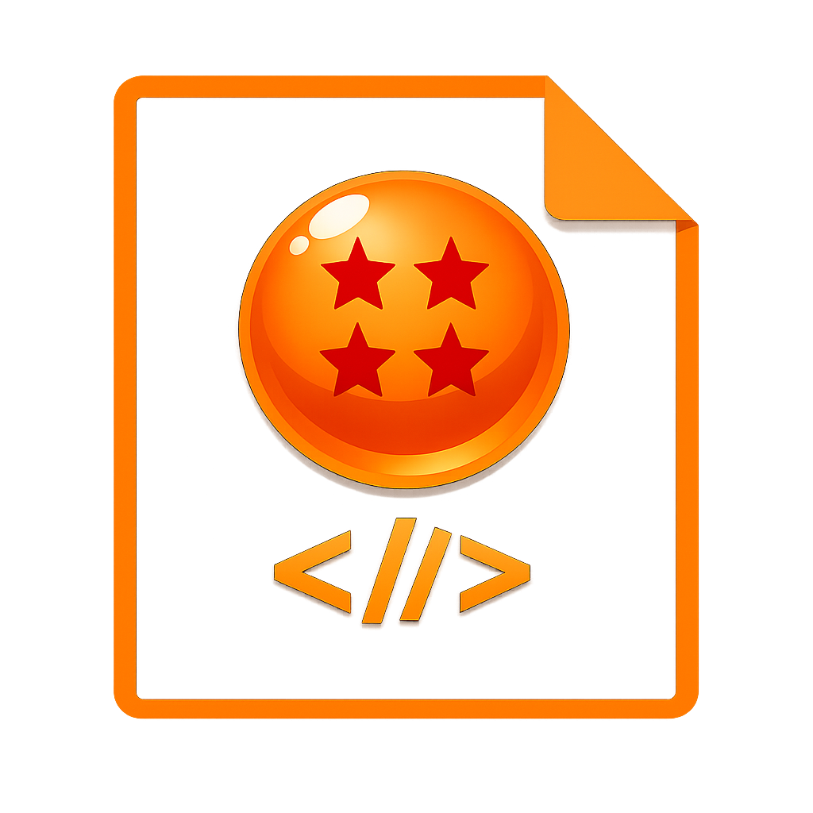

<div align="center">
  
  
  # 🐉 DragonScript
</div>

> Un lenguaje de programación interpretado inspirado en el universo de **Dragon Ball**, implementado en Python y pensado para **aprender a programar desde cero**.

DragonScript **no** es una simple sustitución de palabras clave: es un lenguaje
con una arquitectura seria y funcional (lexer → parser → AST → intérprete) cuya
temática Dragon Ball convive con una semántica real de programación.

Todas sus palabras clave son del universo Dragon Ball y están **en español**, y
el proyecto incluye un **curso completo** que enseña a programar siguiendo una
secuencia pedagógica progresiva (estilo *Gobstones* / UNQ).

```
Código DragonScript → Lexer → Tokens → Parser → AST → Interpreter → Runtime Dragon Ball
```

---

## 🎓 Propósito educativo

DragonScript está diseñado para que alguien que **nunca programó** pueda
aprender los fundamentos de a poco. En `examples/curso/` hay **18 lecciones**
ordenadas, cada una introduce una sola idea nueva sobre las anteriores:

programas → procedimientos y contratos → repetición simple → parámetros →
expresiones y tipos → alternativa condicional → funciones → repetición
condicional → variables → funciones con procesamiento → recorrido de
acumulación → búsqueda → recorridos sobre rangos → registros → listas →
procesamiento de listas.

👉 Empezá por [`examples/curso/README.md`](examples/curso/README.md) y leé la
guía completa en **[`GUIA_CURSO.pdf`](GUIA_CURSO.pdf)**.

---

## ✨ Características

- Variables con `KI`, salida con `SCOUTER`.
- Tipos: números (enteros y flotantes), cadenas UTF-8 (con acentos y `¡ ¿`),
  booleanos (`CANON`/`RELLENO`), nulo (`VACIO`), listas y **rangos** `[1..10]`.
- Operadores aritméticos (`+ - * / %`), de comparación (`== != < > <= >=`),
  lógicos (`FUSION` / `DESEO` / `INVERTIR`) y de asignación compuesta (`+= -= *= /=`).
- Control de flujo: `SENSAR` / `ESQUIVAR SENSAR` / `ESQUIVAR`, `ENTRENAR`
  (mientras), `GRAVEDAD N { }` (repetir *N* veces) y `RASTREAR x EN grupo { }`
  (recorrer cada elemento de una lista, texto o rango).
- Funciones con `TECNICA`, argumentos, `TRANSMITIR` (return), recursividad y closures.
- **Programación Orientada a Objetos / Registros**: `CAPSULA` (clase/registro),
  `ACTIVAR` (crear), constructor `__init__`, `YO` (self), atributos/métodos de
  instancia y de clase, métodos estáticos (`LEGENDARIO`), encapsulación
  (miembros `_privados`), herencia simple y múltiple (`EVOLUCIONA` con MRO C3) y
  sobrecarga de operadores.
- Listas: acceso e índice, concatenación con `+`, y funciones `LONGITUD`,
  `ESTA_VACIA`, `CABEZA`, `COLA`, `ABSORBER`, `RANGO`.
- Funciones matemáticas: `ABS`, `SQRT`, `POW`, `MAX`, `MIN`, `ROUND`, `FLOOR`,
  `CEIL`, `LEN`, `STR`, `NUM`. Entrada de usuario con `INPUT`.
- Errores temáticos de Dragon Ball (¡el Scouter explota!).
- Capa de datos Dragon Ball: personajes, transformaciones, técnicas, razas,
  esferas del dragón, fusiones y los 12 universos.

> **Compatibilidad:** las palabras en inglés de versiones anteriores (`IF`,
> `WHILE`, `TECHNIQUE`, `WARRIOR`, `SELF`, `TRUE`…) siguen funcionando como
> **alias ocultos**, así que los programas viejos no se rompen.

---

## 📦 Instalación

Requiere **Python 3.8+**. No hay dependencias externas.

```bash
git clone https://github.com/zeraus17/DragonScript.git
cd DragonScript
```

---

## ▶️ Cómo ejecutar

```bash
python main.py programa.ds     # ejecuta un archivo .ds
python main.py --repl          # modo interactivo (REPL)
python main.py --version       # muestra la versión
python main.py --help          # muestra la ayuda
```

En **Windows** las rutas usan `\`:

```
python main.py examples\curso\01_programas.ds
```

También podés abrir el proyecto en **Visual Studio Code** y apretar **F5**
(ver [`EJECUTAR_F5.pdf`](EJECUTAR_F5.pdf)).

---

## 🚀 Tu primer programa

```dragonscript
KI poder = 9000
SCOUTER poder
SENSAR poder > 8000 {
    SCOUTER "¡Es más de 8000!"
}
```

Salida:

```
9000
¡Es más de 8000!
```

---

## 📖 Referencia de sintaxis

### Variables (`KI`) y salida (`SCOUTER`)

```dragonscript
KI poder = 9000
KI nombre = "Goku"
SCOUTER "Nivel: " + poder      # concatena texto y número
```

### Condicionales (`SENSAR` / `ESQUIVAR SENSAR` / `ESQUIVAR`)

```dragonscript
SENSAR poder > 9000 {
    SCOUTER "¡Increíble!"
} ESQUIVAR SENSAR poder > 5000 {
    SCOUTER "Muy fuerte"
} ESQUIVAR {
    SCOUTER "Sigue entrenando"
}
```

### Bucles (`ENTRENAR`, `GRAVEDAD` y `RASTREAR`)

```dragonscript
KI i = 0
ENTRENAR i < 3 {          # mientras (while)
    SCOUTER i
    i += 1
}

GRAVEDAD 5 {              # repetir N veces
    SCOUTER "¡Entrenando bajo gravedad aumentada!"
}

RASTREAR g EN ["Goku", "Vegeta"] {   # recorrer cada elemento
    SCOUTER g
}
```

### Rangos

```dragonscript
SCOUTER [1..5]           # [1, 2, 3, 4, 5]
RASTREAR n EN [1..10] {
    SCOUTER 7 * n
}
```

### Funciones (`TECNICA` / `TRANSMITIR`)

```dragonscript
TECNICA factorial(n) {
    SENSAR n <= 1 {
        TRANSMITIR 1
    }
    TRANSMITIR n * factorial(n - 1)
}
SCOUTER factorial(5)      # 120
```

### Listas

```dragonscript
KI equipo = ["Goku", "Vegeta", "Gohan"]
SCOUTER equipo[0]              # Goku
SCOUTER LONGITUD(equipo)      # 3
SCOUTER CABEZA(equipo)        # Goku
SCOUTER COLA(equipo)          # [Vegeta, Gohan]
KI ampliado = ABSORBER(equipo, "Piccolo")   # lista nueva con un elemento más
KI todos = equipo + ["Freezer"]             # concatenar con +
```

### Registros / POO (`CAPSULA` / `ACTIVAR` / `YO`)

Un **registro** (o clase) es un `CAPSULA`; se crea con `ACTIVAR` y dentro de
sus técnicas la propia instancia se llama `YO`. La herencia se expresa con
`EVOLUCIONA`.

```dragonscript
CAPSULA Peleador {
    LEGENDARIO planeta = "Tierra"          # atributo de CLASE (compartido)

    TECNICA __init__(nombre, poder) {
        YO.nombre = nombre                 # campo público
        YO._poder = poder                  # campo PRIVADO (empieza con "_")
    }
    TECNICA getPoder() { TRANSMITIR YO._poder }
    TECNICA __str__() { TRANSMITIR YO.nombre + " [" + YO._poder + "]" }
}

CAPSULA Saiyajin EVOLUCIONA Peleador {
    TECNICA __init__(nombre, poder) {
        Peleador.__init__(YO, nombre, poder)   # llama al constructor del padre
        YO.raza = "Saiyajin"
    }
    TECNICA __add__(otro) {                     # sobrecarga de +
        TRANSMITIR ACTIVAR Saiyajin("Gogeta", YO.getPoder() + otro.getPoder())
    }
}

KI goku = ACTIVAR Saiyajin("Goku", 9000)
KI vegeta = ACTIVAR Saiyajin("Vegeta", 8500)
SCOUTER goku                 # Goku [9000]   (usa __str__)
SCOUTER goku.raza            # Saiyajin
KI gogeta = goku + vegeta    # sobrecarga de +
SCOUTER gogeta               # Gogeta [17500]
```

**Capacidades soportadas:** clases/registros y objetos, constructor `__init__`,
atributos y métodos de instancia (con `YO`), atributos de clase, métodos
estáticos (`LEGENDARIO TECNICA`), encapsulación (miembros `_privados`), herencia
simple y múltiple (`EVOLUCIONA A, B` con MRO **C3**), llamada al padre y
sobrecarga de operadores (`__add__`, `__sub__`, `__mul__`, `__div__`, `__mod__`,
`__eq__`, `__neq__`, `__lt__`, `__gt__`, `__lte__`, `__gte__`, `__str__`).

> Ejemplo completo y comentado en [`examples/oop.ds`](examples/oop.ds) y en la
> lección [`examples/curso/14_registros.ds`](examples/curso/14_registros.ds).

---

## 🗺️ Tabla de palabras clave

| DragonScript | Equivalente tradicional      | Descripción                          | Alias inglés |
|--------------|------------------------------|--------------------------------------|--------------|
| `KI`         | `let` / `var`                | Declara una variable                 | —            |
| `SCOUTER`    | `print`                      | Imprime un valor                     | —            |
| `SENSAR`     | `if`                         | Condicional                          | `IF`         |
| `ESQUIVAR`   | `else`                       | Alternativa                          | `ELSE`       |
| `ENTRENAR`   | `while`                      | Bucle condicional                    | `WHILE`      |
| `GRAVEDAD`   | `for _ in range(N)`          | Repite un bloque *N* veces           | `GRAVITY`    |
| `RASTREAR … EN` | `for x in …`              | Recorre cada elemento                | `FOREACH`    |
| `TECNICA`    | `def` / `function`           | Define una función o método          | `TECHNIQUE`  |
| `TRANSMITIR` | `return`                     | Devuelve un valor                    | `RETURN`     |
| `CAPSULA`   | `class` / `record`           | Define una clase o registro          | `WARRIOR`    |
| `ACTIVAR`    | `new`                        | Crea una instancia / registro        | `CREATE`     |
| `EVOLUCIONA` | `extends` / `(Base)`         | Herencia (simple o múltiple)         | `EVOLVES`    |
| `LEGENDARIO` | `static`                     | Método o atributo de clase           | `STATIC`     |
| `YO`         | `this` / `self`              | La propia instancia                  | `SELF`       |
| `FUSION`     | `and` / `&&`                 | Y lógico                             | `AND`        |
| `DESEO`      | `or` / `\|\|`                | O lógico                             | `OR`         |
| `INVERTIR`   | `not` / `!`                  | Negación lógica                      | `NOT`        |
| `CANON`      | `true`                       | Booleano verdadero                   | `TRUE`       |
| `RELLENO`    | `false`                      | Booleano falso                       | `FALSE`      |
| `VACIO`      | `null` / `None`              | Valor nulo                           | `NULL`       |
| `IMPORTAR`   | `import`                     | Importa un módulo .ds                | `IMPORT`     |
| `ROSHI`      | `procedure` (void)           | Define un procedimiento sin retorno  | —            |

**Funciones de lista:** `LONGITUD`, `ESTA_VACIA`, `CABEZA`, `COLA`, `ABSORBER`,
`RANGO`.

---

## 🎯 El Tablero (estilo Gobstones)

DragonScript incluye un **tablero** para practicar recorridos de forma visual,
inspirado en Gobstones. Es una grilla donde un cabezal llamado `GUERRERO`
se mueve por las celdas y guarda **esferas del dragón** (cuatro tipos).

El origen `(0,0)` está abajo a la izquierda: `NORTE` sube, `SUR` baja,
`ESTE` va a la derecha y `OESTE` a la izquierda.

| Comando | Descripción |
|---------|-------------|
| `INICIAR_TABLERO(ancho, alto)` | Crea un tablero y para el cabezal en (0,0) |
| `GUERRERO` | El cabezal del tablero |
| `NORTE` / `SUR` / `ESTE` / `OESTE` | Las cuatro direcciones |
| `ESFERA_1` … `ESFERA_4` | Los cuatro tipos de esfera |
| `VOLAR(dir)` | Mueve el cabezal una celda |
| `PUEDE_VOLAR(dir)` | ¿Se puede mover sin salir del borde? |
| `CARGAR(esfera)` / `DRENAR(esfera)` | Pone / saca una esfera en la celda actual |
| `HAY(esfera)` / `CUANTAS(esfera)` | ¿Hay? / ¿cuántas? en la celda actual |
| `POSICION_X()` / `POSICION_Y()` | Columna / fila del cabezal |
| `MOSTRAR_TABLERO()` | Dibuja el tablero en pantalla |

```dragonscript
INICIAR_TABLERO(3, 3)
CARGAR(ESFERA_1)
VOLAR(NORTE)
CARGAR(ESFERA_2)
MOSTRAR_TABLERO()
```

Ver las lecciones `17_tablero.ds` y `18_recorrido_tablero.ds` del curso.

---

## 💥 Errores temáticos

DragonScript reporta los errores con mensajes del universo Dragon Ball:

| Situación                 | Mensaje                                                  |
|---------------------------|---------------------------------------------------------|
| Carácter desconocido      | `¡El Scouter explotó! Carácter desconocido: X en línea Y` |
| Error de sintaxis         | `¡Error de Ki Sintáctico! ...`                          |
| Variable no definida      | `¡Alerta! El Scouter no detecta 'x'! Variable no definida.` |
| División por cero         | `¡Imposible! Ni Vegeta divide entre cero.`              |
| Tipo incorrecto           | `¡Error de transformación de tipo! ...`                 |
| Recursión infinita        | `¡El poder es demasiado! Stack overflow: recursión infinita.` |
| Argumentos incorrectos    | `¡Técnica fallida! Número de argumentos incorrecto.`    |

---

## 🧱 Arquitectura del proyecto

```
DragonScript/
├── dragonscript/
│   ├── __init__.py        # API pública (run_source, run_source_capture)
│   ├── tokens.py          # Tipos de token y keywords (español + alias inglés)
│   ├── lexer.py           # Tokenizador
│   ├── ast_nodes.py       # Nodos del AST
│   ├── parser.py          # Parser descendente recursivo
│   ├── interpreter.py     # Intérprete tree-walking
│   ├── environment.py     # Ámbitos (scopes) anidados
│   ├── runtime.py         # Tipos internos y funciones built-in
│   ├── objects.py         # POO: clases, instancias, métodos y MRO (C3)
│   ├── errors.py          # Excepciones temáticas
│   └── dragonball/        # Capa temática Dragon Ball
├── examples/
│   ├── curso/             # 🎓 Curso de 18 lecciones progresivas
│   └── *.ds               # Otros ejemplos
├── tests/                 # Tests con unittest
├── GUIA_CURSO.md/.pdf     # Guía teórica del curso
├── main.py                # Punto de entrada (archivo / REPL / versión)
└── README.md
```

---

## 🧪 Tests

```bash
python -m unittest discover -s tests -v
```

Cubren el lexer, el parser, el intérprete, la POO, las palabras clave en español
y las funcionalidades v2 (RASTREAR, rangos, listas). En total hay **96 tests** y
todos pasan.

---

## 🛣️ Hoja de ruta

- **Núcleo** ✅: lexer, parser, AST, intérprete, variables, control de flujo,
  funciones, recursividad, listas, rangos, **POO/registros completos** y errores
  temáticos.
- **Español temático** ✅: todas las palabras clave en español, con alias inglés
  ocultos para compatibilidad.
- **Curso educativo** ✅: 18 lecciones progresivas + guía teórica en PDF.
- **Módulos e import** ✅: `IMPORTAR "Biblioteca"` (y cualquier módulo .ds).
- **Biblioteca estándar de tablero** ✅: MOVER_N, PONER_N, DRENAR_N, IR_AL_ORIGEN...
- **Próximo**: formateador automático, depurador visual y más módulos temáticos.

---

## 🤝 Contribución

1. Haz un *fork* del repositorio.
2. Crea una rama: `git checkout -b mi-tecnica`.
3. Asegúrate de que los tests pasan: `python -m unittest discover -s tests`.
4. Haz *commit* y *push* de tus cambios.
5. Abre un *Pull Request* describiendo tu técnica.

---

## 📜 Licencia

Distribuido bajo la licencia **MIT**. Consulta el archivo [`LICENSE`](LICENSE).

---

> *"¡El poder de la programación no tiene límites... ni siquiera 8000!"* 🐉
